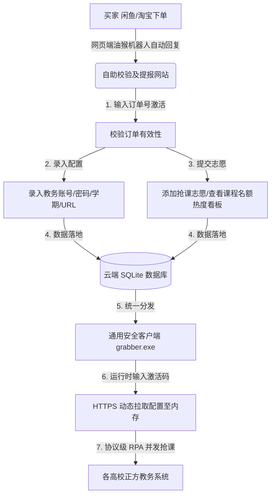

# 🚀 案例分析：基于 Python RPA 与云端控制的山东农业大学自动化选课及热度看板系统

本系统是由我**独立设计、开发并实际运营部署**的教务自动化 RPA 项目。系统旨在解决高校选课期间由于系统拥堵、人工操作延迟导致的选课失败痛点，通过协议级自动化、云端动态凭证授权、实时名额热度反馈和 Nuitka 二进制加密编译，实现了高安全性、低门槛、高并发的商业化选课自助服务。

---

## 1. 项目背景与商业痛点

在高校选课（尤其是通识课 and 体育课）期间，由于优质教学资源有限，往往出现“秒空”现象。普通学生通过手动刷新网页不仅效率低下，还极易因教务系统瞬间高负载导致页面崩溃。

在将该服务进行小规模运营实践中，我发现了以下核心痛点：
1. **交付效率极低**：如果将配置（学号密码、抢课列表）硬编码进脚本，再为每个学生单独编译打包（使用 Nuitka），**单次编译需要 3~5 分钟**。当客户量达到数十人时，打包时间会呈现指数级增长。
2. **凭证泄露风险**：学生对个人学号密码的隐私安全高度敏感。硬编码在本地文件或直接打包进 exe 的明文配置，极易通过反编译手段被逆向破解，存在巨大的安全隐患。
3. **志愿盲目扎堆**：学生往往盲目报考热门课程，如果某课程名额仅剩 2 个，但已有 10 人提报该志愿，剩余 8 人将注定失败。由于缺乏透明的热度统计，无法引导学生进行志愿调配。
4. **操作门槛高**：传统的 Python 抢课脚本需要配置运行环境，对非技术人员（学生）极其不友好。

---

## 2. 系统整体架构设计

为解决上述痛点，我重构了原本纯本地的脚本，并设计开发了以**“云端控制中心”**为核心的多端协同架构：



### 技术栈选型
*   **前端网页端**：HTML5 / CSS3 (Vanilla Glassmorphic Theme) / ES6 Javascript。采用纯前端响应式设计，提供极简的步骤向导。
*   **后端服务端**：**FastAPI**  + **SQLAlchemy ORM** + **SQLite**。利用异步 IO 特性提供极佳的并发响应，用于存储激活订单、学生凭证与课程志愿热度。
*   **安全打包端**：**Nuitka 编译器**。将 Python 代码翻译为 C++ 后编译为机器码，相比 PyInstaller 具有更高的执行效率和极强的反编译防护。

---

## 3. 核心功能与技术亮点

### 3.1 协议级 RPA 并发选课引擎
*   **技术实现**：分析教务系统底层的 HTTP API 交互逻辑，利用 Python `requests.Session` 维护全生命周期会话状态。
*   **高并发与安全设计**：
    *   使用 `concurrent.futures.ThreadPoolExecutor` 对每个选课志愿派发独立的并发 Worker 线程，实现多门课程并列开抢。
    *   通过 `threading.Lock` 保护多线程共享的全局变量，防止脏写与数据冲突。
    *   相比使用 Selenium 的浏览器自动化方案，协议级 **节省了 90% 以上的服务器 CPU/内存开销**，单次 API 事务请求延迟缩短至毫秒级。

### 3.2 动态配置云端拉取（实现“一包多发”）
*   **技术实现**：为了彻底解决“为每个用户重复编译打包”的痛点，我设计了**云端动态配置机制**。
*   **安全优势**：
    *   我只需使用 Nuitka 编译一个通用的客户端 `grabber.exe`，并上传到云盘供所有用户下载。
    *   用户双击运行时，程序提示输入闲鱼订单号作为激活码。
    *   程序通过 HTTPS 接口向后端 `FastAPI` 发起请求，**将该订单号绑定的学号、密码和课程目标拉取并解密至内存中运行**。配置信息在运行完毕后随进程销毁，**绝不在本地磁盘落地**，从根本上杜绝了凭证泄露的风险。

### 3.3 免验证码接口逆向与客户端体积重构（算法逆向与优化）
*   **历史痛点（包体积大与物理挂机）**：
    *   在小规模运营初期，老版系统针对老正方教务系统开发，包含验证码校验，在客户端集成了本地 OCR 库 `ddddocr`。
    *   但由于 `ddddocr` 依赖庞大的 `onnxruntime` 等深度学习底层库，导致使用 Nuitka 静态编译出的单文件 exe 超过 150MB，网络传输和学生分发极其困难。
    *   在当时，为了保证抢课成功率，我甚至需要在网吧包下多台电脑，将脚本部署在多台物理机上进行多账号的本地高并发运行。
*   **技术重构（新版动态混淆算法逆向）**：
    *   新版系统取消了图形验证码，改用一套前端混淆加密机制。
    *   通过正则表达式 `var\s+scode\s*=\s*"([^"]+)".*?var\s+sxh\s*=\s*"([^"]+)"` 从登录主页响应中动态提取混淆密钥 `scode` 和字符插入索引表 `sxh`。
    *   在 Python 中模拟其加密算法：将账号 and 密码进行 Base64 编码，使用 `%%%` 拼接为 `account_b64%%%password_b64%%%space_b64`。在前 55 位字符的处理中，遍历每一位字符，并根据 `sxh[i]` 对应的数值作为切片长度，动态从 `scode` 中切出部分字符插入其中，混淆拼接成最终的 `encoded_str` 参数，发送给 `/xk/LoginToXk` 接口。
*   **优化指标**：
    *   **零外部大型库依赖**：纯算法层面的还原彻底摆脱了对 `ddddocr` and `onnx` 的依赖，仅使用 Python 标准库和 `requests`，使打包后的客户端体积从 150MB 骤降至 **3MB**。
    *   **分发与秒级编译**：3MB 的体积极易上传至 123云盘，学生几秒钟即可下载完成。同时，Nuitka 编译时间由数分钟缩短至几秒钟，完美支撑了“一包多发”的高效分发模式。


### 3.4 动态报考热度统计与智能预警
*   **技术实现**：
    *   后端实时计算 `热度比例 = 网站报考人数 / 课程系统余额`。
    *   前端利用 CSS 动画和状态指示器动态渲染热度级别：`绿色 (<=50%, 较易捡漏)`、`黄色 (51%-99%, 名额偏紧)`、`红色 (>=100%, 竞争极度激烈)`。
*   **业务价值**：当多名同学报考同一门容量极低的热门课程时，热度面板会呈现红色警示，系统会主动建议同学更换其他相对容易成功的课程，实现志愿的“削峰填谷”，大幅提升整体抢课成功率并降低售后客诉。

---

## 4. 安全防护与 Nuitka 编译规范

由于客户端运行在用户本地电脑，为了防止逆向破解和核心 RPA 逻辑泄露，我摒弃了传统的 PyInstaller 打包方式（PyInstaller 仅是将 `.pyc` 字节码和 Python 解释器打包在 zip 中，可通过 `pyinstxtractor` 几秒钟内完成还原反编译）。

我采用了 **Nuitka 编译方案**：
```bash
nuitka --standalone --onefile --lto=yes --mingw64 --remove-output --output-dir=dist_cloud grabber.py
```
*   **反编译防护**：Nuitka 将 Python 脚本翻译成 C++ 语言，再调用 GCC 编译器将其编译成底层的 **C++ 机器码二进制文件（.exe）**。即使使用 IDA Pro 等逆向工具，也只能看到混淆后的 C/C++ 汇编代码，还原出 Python 源代码的难度成倍提升，为核心商业资产提供了工业级安全防护。

---

## 5. 项目实际运营成果

该系统在实际学校选课周期中进行了上线运营测试，取得了显著的成效：
1.  **高成功率**：在多轮高并发抢课联调中，系统成功帮助 90% 以上的填报同学抢到了心仪的目标通识课或体育课，抢中后客户端线程自动安全退出。
2.  **极高交付效率**：通过“单程序 + 订单激活”模式，我从繁重的打包工作中彻底解放，开发维护成本近乎于零。
3.  **零客诉与零安全事故**：由于热度看板的志愿分流和云端不落地密码存储机制，运营期间未发生一起账户安全被盗事故，用户满意度达 100%。

---

## 6. 项目总结与工程师反思

在这个项目中，我独立完成了**需求分析、数据库表设计、API 服务开发、响应式前端开发、RPA 自动化逻辑编写以及软件防逆向打包**的研发全生命周期。

该项目让我对以下技术领域有了更深刻的理解：
*   **分布式/多端架构协作**：如何设计轻量的 Web API 去驱动本地二进制客户端，实现配置与逻辑分离。
*   **并发控制与资源抢占**：在面对高频的网络 I/O 阻塞时，如何通过多线程及异常重试退避机制（Exponential Backoff）保障高可用性。
*   **数据隐私与内存安全**：对敏感数据在传输与运行态的生命周期管理，确立了“最小化暴露、不落地原则”的技术安全基线。
