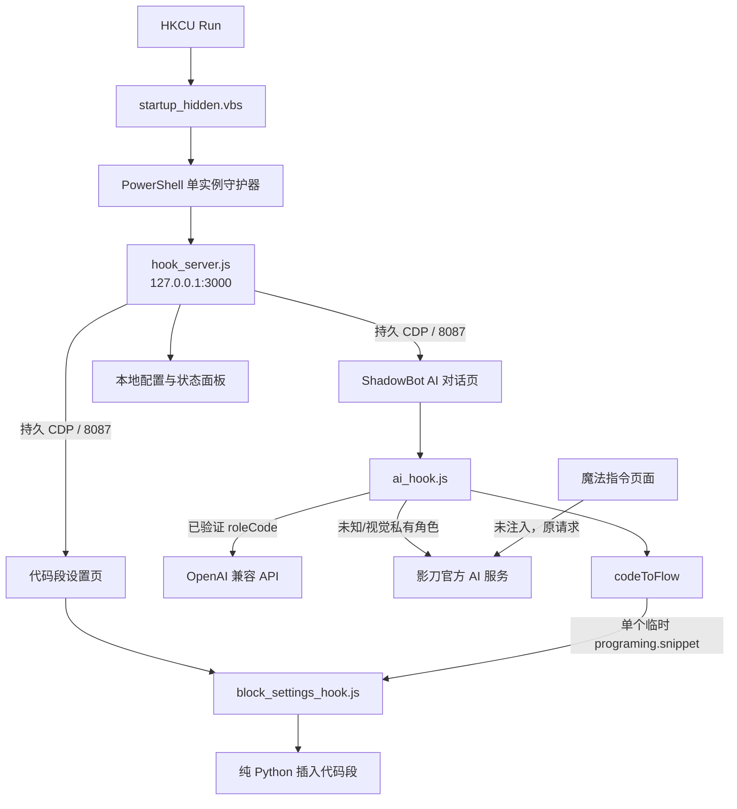
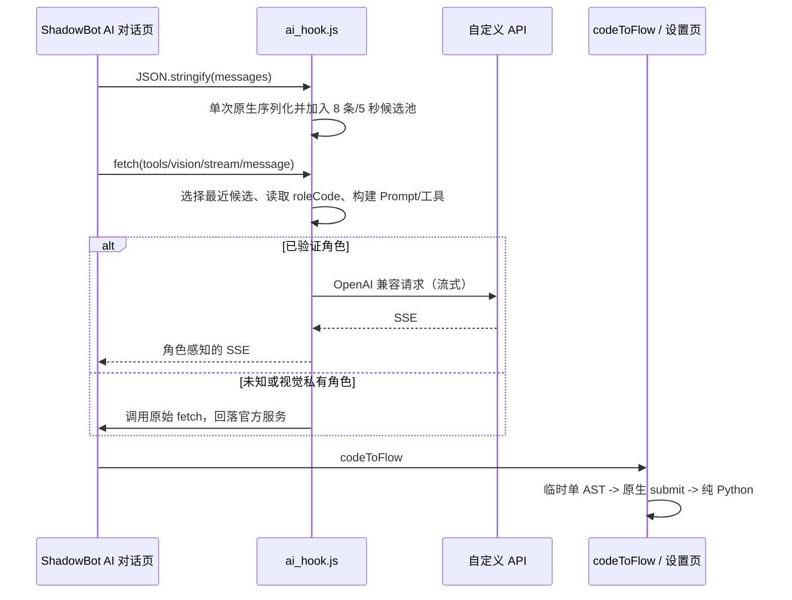

# ShadowBot AI Replacement Hook：影刀 RPA AI 请求链逆向与运行时替换

> **项目类型**：桌面应用逆向工程、浏览器运行时注入、协议兼容与 Windows 工程化  
> **目标版本**：影刀 RPA（ShadowBot）v6.2.21，.NET 6.0 / WPF / CefSharp  
> **当前版本日期**：2026-07-15  
> **最终成果**：不修改影刀安装文件，通过持久 CDP 会话在 AI 对话页注入 Hook，将已验证的流程搭建角色转发到 OpenAI 兼容 API，并保持影刀工具调用、SSE、`codeToFlow` 和单代码段落地契约  
> **技术栈**：dnSpy、Fiddler、Chrome DevTools Protocol、CefSharp、Node.js、JavaScript、PowerShell、RSA/AES-GCM 分析

本文不是简单的安装说明，也不声称已经取得影刀服务端隐藏 Prompt。它记录从错误假设、静态分析、网络取证到可维护实现的完整证据链，并明确区分“已观察事实”“工程推断”和“当前实现边界”。所有示例均省略真实 API Key、授权令牌和完整 RSA 公钥。

---

## 目录

1. [项目背景、范围与结论](#1-项目背景范围与结论)
2. [第一阶段：dnSpy 静态反编译](#2-第一阶段dnspy-静态反编译)
3. [第二阶段：发现 CefSharp 内嵌浏览器](#3-第二阶段发现-cefsharp-内嵌浏览器)
4. [第三阶段：JavaScript 加密逻辑逆向](#4-第三阶段javascript-加密逻辑逆向)
5. [第四阶段：Hook 方案设计与实现](#5-第四阶段hook-方案设计与实现)
6. [第五阶段：CDP 注入机制](#6-第五阶段cdp-注入机制)
7. [第六阶段：工具契约与循环修复](#7-第六阶段工具契约与循环修复)
8. [第七阶段：持久化与开机自启](#8-第七阶段持久化与开机自启)
9. [当前最终架构](#9-当前最终架构)
10. [完整文件清单](#10-完整文件清单)
11. [部署与使用](#11-部署与使用)
12. [关键问题与经验](#12-关键问题与经验)
13. [2026-07-15 工程化审计与重构](#13-2026-07-15-工程化审计与重构)
14. [验证矩阵、限制与后续研究](#14-验证矩阵限制与后续研究)
15. [附录：工具参数与状态字段](#15-附录工具参数与状态字段)

---

## 1. 项目背景、范围与结论

影刀 RPA 支持通过 AI 对话生成自动化流程。客户端并不是把普通 OpenAI 消息直接发给模型：流程消息先在 CefSharp 前端中加密，服务端再按 `roleCode` 选择私有 Prompt、模型和工具执行契约。因此“只替换 URL”或“只复制一段 Prompt”都不足以保持原有流程搭建行为。

### 1.1 核心目标

- 将侧边栏中已验证的流程搭建角色转发到任意 OpenAI 兼容 API
- 保持影刀前端可执行的工具名称、snake_case 参数和 SSE 返回格式
- 让完整 Python 程序最终只落入一个“插入代码段(Python)”节点，并保存为纯源码
- 在刷新、内部重载、多窗口和开机启动场景下稳定注入
- 把 API Key、管理端口和 CDP 表达式的安全边界收敛到本机
- 不修改影刀安装目录、DLL 或前端资源包，所有行为均可卸载和回滚

### 1.2 当前实现结论

| 能力 | 当前状态 |
|------|----------|
| AI 对话顶层角色 | 使用自定义模型，提供精简 Prompt 与 7 个必要工具 Schema |
| 代码格式化、合并、摘要角色 | 使用自定义模型，但不下发顶层工具 |
| 未知、视觉及其他私有内部角色 | 原样回落影刀官方服务，不用泛化 Prompt 猜测 |
| 魔法指令端点 | 不注入、不接管，继续使用影刀官方模型与私有 Prompt |
| GLM-5 | 关闭思考；文本接口自动剥离历史图片片段并保留 DOM/工具文本 |
| Gemini 3 | 请求附加最小思考参数 |
| 流程代码落地 | 单个 `programing.snippet`，最终节点为纯 Python，无 `exec` / `compile` / Base64 |
| 注入生命周期 | 持久 CDP 会话 + document-start 预加载 + 当前页补注入 + 健康检查 |
| 本地管理面 | 仅 `127.0.0.1:3000`，无宽松 CORS，密钥掩码，写请求严格校验 |

### 1.3 明确边界

- 官方 Prompt 在服务端按 `roleCode` 加载，当前浏览器请求中没有可直接复制的完整原文；本项目使用的是从可见协议和实测行为重建的兼容 Prompt。
- Chat Completions 通常是无状态接口，System Prompt 和工具 Schema 仍需每轮携带；本项目通过精简固定前缀而不是错误地“只发一次”来降低开销。
- 全局 `JSON.stringify` Hook 仍是时间关联方案，不等价于请求 ID 级绑定；候选池只能降低而不能理论上消除并发串线。
- 本项目用于本机已授权环境中的兼容性研究，不绕过账号权限、授权令牌、验证码或服务端访问控制。

### 1.4 证据与复现方法

研究过程使用四类证据相互校验：

1. **静态证据**：DLL 类型、PDB 符号、前端打包代码、函数引用和字符串常量。
2. **动态证据**：dnSpy 运行时调试、CefSharp CDP Runtime/Network、Fiddler 请求与 SSE 响应。
3. **行为证据**：工具参数错误、`roleCode` 差异、`codeToFlow` 拆分结果、模型特定 400/429 响应。
4. **工程验证**：Node 语法检查、模拟 fetch/SSE、Base64 往返一致性、端口与进程检查、刷新和多窗口测试。

---

## 2. 第一阶段：dnSpy 静态反编译

### 2.1 初步探查

影刀安装路径为 `C:\Program Files\ShadowBot\shadowbot-6.2.21\`。通过 `dnSpy.Console.exe` 反编译关键 DLL：

```bash
# 导出整个 DLL 为 C# 项目
D:\dnSpy-net-win64\dnSpy.Console.exe -o <output_dir> <dll_path> --no-sln

# 反编译指定类到 stdout
D:\dnSpy-net-win64\dnSpy.Console.exe -t <TypeName> <dll_path>

# 切换 IL 语言模式
D:\dnSpy-net-win64\dnSpy.Console.exe -l IL <dll_path>
```

### 2.2 关键 DLL 识别

通过分析 .pdb 调试符号和类型引用关系，定位了四个核心 DLL：

| DLL | 职责 |
|-----|------|
| `Components.dll` | `ChatGPTApi` 实现 + `ApiClient` + `ExecuteWithSignAsync` 签名请求 |
| `Components.Protocol.dll` | `IChatGPTApi` 接口定义 + RSA 加密字段 |
| `Shell.Development.dll` | `MagicFlowChatViewModel`（AI 对话视图模型）+ `SkillStorage` |
| `Runtime.Development.dll` | `IWebExecuter` + CefSharp 桥接 |

### 2.3 RSA 加密字段发现

在 `Components.Protocol.dll` 中找到 `IChatGPTApi` 接口，其中包含一个名为 `ni8sFJYE3` 的字段——这是一个 RSA 公钥的存储位置。同类的 `fqro0HjUtL` 方法实为 `VirtualAlloc`（内存分配），并非 RSA 相关。

进一步追踪发现混淆类 `WqvWUdBjXjZdpSFeKY`，尝试在其中搜索 `.rQfKQy2FK` 方法或 `Encrypt`/`Decrypt` 关键词。

### 2.4 挫折：运行时混淆

dnSpy 反编译结果中，关键方法体（如 `ChatGPTApi.GetChatSolutionAsync`）**全部显示为 `nop`**——方法体被 `COJKMRMmH4()` 在运行时动态解密。静态分析只能看到空操作码，无法获取真实逻辑。

### 2.5 dnSpy GUI 运行时调试

尝试用 dnSpy GUI 附加到进程进行运行时调试：

1. 引擎选择 `.NET Core`（非 Framework）
2. 工作目录设为 exe 根目录（`C:\Program Files\ShadowBot\shadowbot-6.2.21\`），而非版本子目录
3. `ShadowBot.exe` 是启动器，`ShadowBot.Shell.exe` 是 UI 主进程——需要附加到后者
4. "启动可执行文件" 方式会遇到 CoreCLR 超时
5. 改用 "附加到进程" (Attach to Process)

**关键发现**：运行时下断点后，观察到 `ChatGPTApi.GetChatSolutionAsync` 的 C# 代码中调用了 `RestSharp` 发送 HTTP 请求——但实际网络抓包显示 AI 请求并非来自 C# RestSharp，而是来自 **CefSharp 内嵌浏览器**的 JavaScript。

### 2.6 关键转折：C# 调用链不是目标流量主路径

通过 Fiddler 抓包确认：

- 目标流程搭建请求没有从该 C# RestSharp 调用点发出；该路径仍可能服务于其他功能
- **实际 AI 请求由 CefSharp 内嵌浏览器的 JavaScript 发起**，User-Agent 为 `Chrome/106`，Origin 为 `http://local.shadowbot.com`
- 流程搭建端点：`POST api.winrobot360.com/api/v1/ai/chat/tools/vision/stream/message`
- 魔法指令端点：`POST api.winrobot360.com/api/v1/ai/chat/vision/stream`，`roleCode` 为 `magic-block-gui-v3`

这意味着 dnSpy 反编译 C# 代码的方向走不通——真正的加密逻辑在 **前端 JavaScript** 中。

---

## 3. 第二阶段：发现 CefSharp 内嵌浏览器

### 3.1 CefSharp 调试端口

影刀使用 CefSharp（Chromium Embedded Framework）作为内嵌浏览器。通过启动参数或环境变量，CefSharp 暴露了 **远程调试端口 8087**，支持 Chrome DevTools Protocol (CDP)。

访问 `http://127.0.0.1:8087/json` 可获取所有 CefSharp 页面列表，包括页面 ID、URL 和 WebSocket 调试 URL。

### 3.2 前端资源定位

影刀的前端资源打包在 `web.pak`（45MB 自定义加密格式）中。解包后发现主入口为 `index.7709827fff35aa8bcac6.js`，所有 AI 加密逻辑都在此文件中。

---

## 4. 第三阶段：JavaScript 加密逻辑逆向

### 4.1 加密函数 `q` 定位

在 `index.7709827fff35aa8bcac6.js` 中搜索 AI 请求路径关键词，定位到函数 `q`，该函数负责完整的加密流程。

### 4.2 完整加密链路

通过分析 `q` 函数及其依赖，还原出完整的加密流程：

```
1. 生成 32 字节随机 AES-256 密钥
2. 从五行算法名（metal/wood/water/fire/earth）中随机选择一个
3. 用对应的 RSA 公钥加密 AES 密钥
4. 用 AES 密钥以 AES-GCM 模式加密消息（IV 为 12 字节随机，tagLength=128）
5. 构建请求体：{ messages: <AES密文>, encryptKey: <RSA密文>, crypt: <算法名>, iv: <IV> }
```

### 4.3 五个 RSA 公钥

`k` 对象存储了 5 个 RSA 公钥，对应五行算法名。公钥以 ASCII 码数组形式存储，通过 `P()` 函数解码为 base64，再转换为 PEM 格式。

```javascript
// 伪代码
const k = {
    metal: [45, 78, ...],  // ASCII 码数组 → PEM 公钥
    wood: [...],
    water: [...],
    fire: [...],
    earth: [...]
};
```

### 4.4 依赖库识别

- `j = n(22079)` → node-forge 库（加密操作）
- `T = n(56084)` → JSBN 库（RSA 加密实例）
- `S = new T.X` → RSA 加密实例

### 4.5 响应不加密

关键发现：AI 响应为 **明文 SSE（Server-Sent Events）**，采用 OpenAI 兼容格式，不经过加密。这意味着只需替换请求路径和请求体，响应可以直接透传。

### 4.6 已观察端点族

| 端点 | 关键输入 | 响应 | 当前决策 |
|------|----------|------|----------|
| `/api/v1/ai/chat/tools/vision/stream/message` | `roleCode`、加密 messages、工具、会话字段 | SSE | 仅已验证角色由 Hook 接管 |
| `/api/v1/ai/chat/vision/stream` | `magic-block-gui-v3`、`user`、`recordList`、`images`、`sessionId` | SSE | 官方旁路 |
| `/api/v1/ai/chat/tokens/count` | 用户文本、记录和图片元数据 | JSON：limit/used/overLimit | 官方工具请求，不拦截 |

抓包样本中的 Authorization、sessionId、图片对象存储地址和用户标识均属于敏感数据，文档只保留字段结构。端点名称中含 `vision` 不代表每个 role 都需要视觉模型；顶层流程同样复用 tools/vision 路径，必须结合 `roleCode` 判断。

### 4.7 替代方案评估

分析了三种替代方案：

| 方案 | 描述 | 可行性 |
|------|------|--------|
| A. SDK markdown 自建 AI 服务 | 在影刀外部搭建 | 偏离目标，无法集成到 AI 对话流 |
| B. 替换 RSA 公钥 | 替换 k 中的公钥 + 运行代理解密 | 复杂，需同时处理加密 and 解密 |
| C. 浏览器内 Hook | Hook fetch/JSON.stringify 拦截明文 | **最优方案**——最简单、最直接 |

最终选择 **方案 C**：通过 CDP 注入 JS Hook，在加密前捕获明文，在请求发送前替换目标地址和请求体。

---

## 5. 第四阶段：Hook 方案设计与实现

### 5.1 Hook 架构

Hook 分为两步：

**第一步：Hook `JSON.stringify`（流程搭建接口）**
- 始终只调用一次原生 `JSON.stringify`，再从已经序列化的结果解析快照，避免重复触发 Proxy getter 或 `toJSON`
- 仅接受所有元素的 `role` 均属于 `user | system | assistant | tool` 的非空消息数组
- 把快照加入最多 8 条、有效期 5 秒的短期候选池；它不是全局单槽，也不是简单 FIFO
- 流程请求到达时选择时间上最接近且早于该请求的候选，并丢弃该候选及更旧候选，降低后台序列化与相邻请求串线的概率
- 不修改原始序列化结果，仅旁路监听；捕获异常只记入状态，不改变原调用行为

**第二步：Hook `window.fetch`**
- 仅检测流程搭建 URL `/api/v1/ai/chat/tools/vision/stream/message`；独立的魔法指令 URL `/api/v1/ai/chat/vision/stream` 明确旁路，继续使用影刀官方服务
- 读取请求中的 `roleCode`；只接管已验证的顶层、代码格式化、代码合并和摘要角色，未知、视觉或其他私有内部角色原样回落影刀官方请求
- 仅为 `ai-flow-top-v3` / `ai-flow-top-v3-high` 下发流程工具；内部子角色使用无工具专用提示词
- 流程搭建使用短期候选池中时间最近的明文 `messages`；文本型 GLM-5 会把消息内容规范为字符串，保留 DOM/refid/工具文本并剥离旧会话中的截图或 `image_url`
- 加入对应角色兼容 Prompt 后发送到配置的 OpenAI 兼容 API
- 返回 Response 对象给影刀的 stream reader

### 5.2 roleCode 与兼容 Prompt

当前前端发送 `roleCode`，但在加密请求前没有携带可复用的完整官方 System Prompt 与模型配置；官方后端按角色加载私有契约。因此不能从一次抓包中“导出官方 Prompt”。当前路由以可验证性为边界：

| roleCode/端点 | 自定义 Hook 行为 |
|---------------|-----------------|
| 空值、`ai-flow-top-v3`、`ai-flow-top-v3-high` | 使用 `top-compact-v2`，下发顶层工具 |
| `ai-flow-code-format-v2` | 无工具格式化角色，缓冲 SSE 后执行单节点转换 |
| `ai-flow-merge-code` | 无工具合并角色，返回完整 Python |
| `ai-flow-memory-summary-v2`、`ai-flow-token-limit-summary`、其他 summary | 无工具摘要角色 |
| 未知、视觉、定位等私有内部角色 | 不猜 Prompt，原请求回落影刀官方服务 |
| `/api/v1/ai/chat/vision/stream` | 魔法指令独立端点完全旁路 |

`top-compact-v2` 只保留真实可执行的工作流：加载必要 Skill、复用已取得的证据、DOM/refid 优先、验证 SDK 签名、一次提交完整 Python、等待工具结果后再结束。它明确删除魔法指令、视觉/OCR、差分补丁、完整推理轨迹以及任何没有本地工具支撑的能力承诺。

之所以每轮仍携带精简 Prompt，是因为通用 Chat Completions 请求没有可靠的服务端会话记忆。错误地只在首轮发送会让后续轮次丢失工具和代码约束；正确优化方式是保持稳定短前缀并让支持方自行做前缀缓存。实测固定开销从约 2.7 KB Prompt + 6.4 KB 工具 Schema 降至约 1.4 KB + 2.9 KB，最小顶层请求约从 9.2 KB 降至 4.5 KB。

### 5.3 工具（Tool）定义

顶层目录定义 7 个必要工具，并按原始请求的工具 ID 过滤后下发。为兼容自定义模型并降低每轮 token，只保留前端执行器所需名称、snake_case 必填参数和短描述；非必填且会诱导长篇分析的 `reasoning_trace` 已删除：

1. `load_skill` - 加载技能包文档
2. `execute_skill_tool` - 执行技能方法
3. `commit_code_patch` - 提交最终代码
4. `enter_mode` - 切换模式
5. `task_done` - 完成任务信号
6. `read_file_data` - 读取文件
7. `ask_user_question` - 向用户提问

关键契约：`enter_mode.mode` 枚举为 `explore | build`；`commit_code_patch` 必填 `explanation`、`patch`、`requirements`；`task_done` 必填 `summary`。子角色请求不附带这些顶层工具，避免格式化或合并阶段递归规划流程。

### 5.4 单个“插入代码段(Python)”落地

`commit_code_patch` 的本地执行器会先格式化代码，再调用 `javascriptBinding.invoke('codeToFlow', ...)`。`codeToFlow` 按 Python AST 把赋值、条件、等待和调用拆成多个可视化指令，因此只要求模型返回“一个完整代码块”并不能保证流程中只有一个节点。

主路径由 AI 对话页和代码段设置页两个 Hook 协作完成。AI Hook 识别 `ai-flow-code-format-v2`（以及合并角色）的内部请求，缓冲该子请求的完整 SSE 内容后再转换：

1. 保留模型提交的完整 Python 模块，并把传统 `if __name__ == "__main__"` 入口规范化为末尾直接调用 `main()` 或 `main(args)`；代码段运行在影刀生成的流程函数内，模块入口判断不会成立；
2. 在外层生成只有一个可执行表达式的临时 `main(args)`；
3. 临时表达式使用单行 `exec(compile(base64源码, ...))` 作为可靠传输层。Base64 仅用于穿过 `codeToFlow` 的逐行反缩进和引号处理，不是最终保存格式；
4. `codeToFlow` 因而只创建一个 `programing.snippet`，即界面的“插入代码段(Python)”；
5. `block_settings_hook.js` 在 `/studio/blockSettings/common/` 页面识别专用标记，通过影刀原生 `getBlock()` 读取当前节点，解码后再用 `submit()` 保存 `10:<纯 Python 源码>`；
6. 最终节点直接显示并执行纯 Python，只保留 `import`、函数定义和末尾直接入口调用，不含 `exec`、`compile`、标记或 Base64；
7. 智能修复请求发出前也会自动解开临时包装，模型始终读取原始源码。

部分 ShadowBot 版本会在 Hook 注入前缓存原始 CefSharp 方法，因此只替换 `javascriptBinding.invoke` 会出现“状态显示已安装、实际调用未经过包装”。现在 SSE 上游转换是主路径；`codeToFlow` bridge（同时兼容对象参数和序列化 JSON 参数）仅作为旧版本或异常响应的兜底。

提交前还执行最小确定性校验：阻止已知不存在的 `xbot.web.web_automation.open_browser`、阻止使用 `logging` 却未导入模块，以及阻止异步 `main` 入口。校验失败时不调用原生 `codeToFlow`，错误会返回 Agent 进入修复轮次，避免把已知不可运行的代码写入流程。

“打开百度”案例同时验证了两个独立问题：模型最初猜出不存在的 `open_browser`，修复后又把 Playwright 初始化、browser/context/page 等每行拆成一个普通指令。前者属于 SDK 契约错误，靠 Skill 证据和提交校验阻止；后者属于 `codeToFlow` 的 AST 行为，必须通过单 AST 传输层解决。单纯加强 Prompt 无法替代这两层确定性机制。

`window.__aiHook.getStatus()` 的 `lastSingleSnippetPath` 表示最后一次转换路径（正常应为 `code-format-sse`，兜底为 `bridge` / `bridge-json`），`singleSnippetTransformCount` 表示当前页面已完成的单节点转换次数，`singleSnippetBridge` 只表示兜底桥接安装方式，`lastCodeValidationError` 记录最近一次被阻止的原因。代码段设置页还提供 `window.__pureSnippetHook.getStatus()`；统一 `/api/status` 将其放在 `pureSnippet` 字段中，其中 `transformCount` 是纯代码替换次数，`lastError` 是最近一次原生提交错误。两个 Hook 的 `uninstall()` 都会清理各自 the 包装或定时器。

### 5.5 Provider 配置与切换

设计了多 Provider 架构，支持运行时切换。分发源码中的密钥始终为空；实际配置由本地服务从 `hook_config.json` 读取后通过安全的 CDP 表达式下发：

```javascript
const PROVIDERS = {
    custom: {
        name: 'Custom',
        apiUrl: '',
        apiKey: '',
        model: '',
        authHeader: 'Authorization',
        authPrefix: 'Bearer '
    },
    gemini: {
        name: 'Gemini',
        apiUrl: 'https://generativelanguage.googleapis.com/v1beta/openai/chat/completions',
        apiKey: '',
        model: 'gemini-3.1-flash-lite',
        authHeader: 'Authorization',
        authPrefix: 'Bearer '
    },
    gemini_flash: {
        name: 'Gemini Flash',
        apiUrl: 'https://generativelanguage.googleapis.com/v1beta/openai/chat/completions',
        apiKey: '',
        model: 'gemini-3.5-flash',
        authHeader: 'Authorization',
        authPrefix: 'Bearer '
    }
};
```

运行时控制 API：
- `window.__aiHook.getStatus()` - 查看当前状态
- `window.__aiHook.switchProvider('custom')` - 切换到自定义
- `window.__aiHook.disable()` - 临时禁用 Hook
- `window.__aiHook.setModel('gemini-3.5-flash')` - 切换模型

### 5.6 429 限流重试

Hook 对 429 执行最多 3 次退避重试。请求体在循环外只序列化一次，避免重试重复触发序列化工作：

```javascript
const serializedAiRequest = origStringify.call(JSON, aiRequest);
while (retryCount <= maxRetries) {
    response = await origFetch.call(window, P.apiUrl, {
        method: 'POST', headers: headers,
        body: serializedAiRequest
    });
    if (response.status === 429 && retryCount < maxRetries) {
        const retryAfter = parseInt(response.headers.get('retry-after') || '2', 10);
        const waitMs = (retryAfter * 1000) + (retryCount * 1000);
        await new Promise(r => setTimeout(r, waitMs));
        retryCount++;
        continue;
    }
    break;
}
```

### 5.7 直连与 CORS 边界

模型请求由 CefSharp 页面直接发送到配置的 OpenAI 兼容端点，不经过本地管理服务。所选 API 必须允许来自 `http://local.shadowbot.com` 的浏览器跨域请求；Google Gemini 和当前使用的智谱兼容端点已在本机验证。若某个兼容层不允许该 Origin，应在可信本机网关上显式配置，而不是把带密钥的无认证代理暴露到网络接口。

---

## 6. 第五阶段：CDP 注入机制

### 6.1 CDP 协议基础

Chrome DevTools Protocol (CDP) 通过 WebSocket 通信。流程：

1. `GET http://127.0.0.1:8087/json` 获取页面列表
2. 严格筛选 `http://local.shadowbot.com` 下的 AI 对话和普通代码段设置路径，并保留所有匹配窗口
3. 对每个目标建立并保持 WebSocket 会话，先调用 `Page.enable`；预加载注册属于 CDP 会话，不能注册后立即断开
4. 通过 `Page.addScriptToEvaluateOnNewDocument` 注册带版本标记的预加载脚本，使同一 CDP target 刷新或内部重载时也能在新文档业务脚本前安装 Hook
5. 对已经打开的当前文档再用 `Runtime.evaluate` 检查并补注入，随后验证 Hook 状态和版本标记；CDP 返回 `exceptionDetails` 也按失败处理
6. 每 1 秒串行发现页面；对状态未变化的已知 target 最多每 5 秒执行一次运行时健康检查。同一轮尚未结束时只排队一次后续检查，避免轮询重叠

### 6.2 当前注入器实现

当前唯一注入入口是 `hook_server.js`。它分别维护 AI Hook 与纯代码收尾 Hook 的 target 状态，状态中记录 WebSocket URL、持久会话令牌、CDP 预加载脚本 ID、源码/配置摘要和最近健康检查时间。AI 对话页注册 `ai_hook.js`，普通代码段设置页注册 `block_settings_hook.js`；魔法设置页不注入，自定义配置不会影响其官方请求。多个匹配窗口会逐一处理，不再只取页面列表中的第一项。页面既支持直接 `/studio/...` 路径，也支持影刀实际使用的 `/xbot_local_pages/pages/studio/...` 打包路径，但 origin 必须严格为 `http://local.shadowbot.com`。

```javascript
await cdpSend(ws, 'Page.enable');
const registered = await cdpSend(ws, 'Page.addScriptToEvaluateOnNewDocument', {
    source: buildAIHookBootstrap(hookB64, config, hookVersion, bootstrapVersion, false)
});

// addScript... 只影响后续文档，因此还要检查并补注入当前文档
const health = await cdpSend(ws, 'Runtime.evaluate', {
    expression: 'JSON.stringify({installed:!!window.__aiHook, marker:window.__shadowBotAIHookBootstrap||null})',
    returnByValue: true
});
```

Hook 或配置摘要变化时，服务端在同一持久 CDP 会话中移除旧的 `Page.addScriptToEvaluateOnNewDocument` 注册并注册新版本；当前页同步下发配置。CDP 断线会使 Chromium 删除该会话的预加载注册，因此服务端会将会话令牌判为过期，重连后重新注册。页面消失后对应 target 状态和连接会被清理。

### 6.3 Base64 编码陷阱

**问题**：PowerShell 的 `[Convert]::ToBase64String()` 对含中文字符的 JS 代码进行编码后，CefSharp 的 `atob()` 解码时出现 `SyntaxError`。

**原因**：PowerShell 默认使用 .NET 字符串编码，与 CefSharp 浏览器期望的 UTF-8 编码不一致，导致多字节字符被错误拆分。

**修复**：使用 Node.js 的 `Buffer` 进行编码，确保 UTF-8 一致性：

```javascript
// encode_b64.js
const fs = require('fs');
const content = fs.readFileSync(__dirname + '/ai_hook.js', 'utf8');
const b64 = Buffer.from(content, 'utf8').toString('base64');
fs.writeFileSync(__dirname + '/ai_hook_b64.txt', b64, 'utf8');
```

### 6.4 WebSocket 客户端选型

**Python websocket-client 失败**：Windows WinError 10013（网络权限策略阻止 Python 的 websocket 库绑定端口）。

**Node.js v22.4+ 内置 WebSocket 成功**：项目启动前会同时检查版本不低于 22.4 且 `globalThis.WebSocket` 可用；推荐使用更新的长期维护版本。

### 6.5 Hook 重注入与可逆恢复

AI 预加载脚本携带服务启动 epoch、Hook 内容摘要和配置摘要。当前页面的标记缺失、版本不一致或 `window.__aiHook` 不健康时，bootstrap 先调用旧实例的 `uninstall()`，恢复原始 `JSON.stringify`、`window.fetch` 和 bridge，再安装新版本，避免产生包装链。纯代码 Hook 同样先调用自身 `uninstall()` 清理定时器和监听器。

开发阶段的 `clear_hook.js` 已删除；直接修改安装标志而不恢复原始函数的旧方案不再使用。

### 6.6 页面刷新与启动时序

只比较 page ID 的旧监控方案存在关键缺陷：同一 CDP target 内刷新时 JavaScript 上下文会重置，但 page ID 可能不变。当前方案把 Hook 注册到 `Page.addScriptToEvaluateOnNewDocument` 并保持承载该注册的 CDP WebSocket；所以相同 target 的 F5、网络重连和内部重载都会执行预加载脚本，不依赖 page ID 变化。实测确认，若注册后关闭 WebSocket，下一次导航不会执行脚本，因此持久连接不是可选优化，而是正确性条件。

服务首次发现一个已经打开的页面时，预加载注册只对下一份文档生效，因此还会立即对当前文档执行健康检查和补注入。之后每 5 秒复核源码/配置摘要与运行时标记，人工卸载、上下文异常或版本漂移都会被修复。新文档预加载还能避免影刀业务代码先缓存原生 `fetch` / `JSON.stringify` 的竞态；对于服务启动前已完成初始化的当前文档，补注入只能尽快接管尚未缓存的调用，因此仍建议让守护器随登录启动。

---

## 7. 第六阶段：工具契约与循环修复

### 7.1 现象

正常聊天没问题，但让 AI 搭建 RPA 流程时，出现持续返回相同响应的无限循环。影刀界面不断显示 "加载技能中..." 但始终失败。

### 7.2 抓包分析

通过 CDP 读取网络请求，发现 AI 反复调用 `load_skill` 工具，但每次都被影刀后端拒绝，错误信息为：

```
Error: Invalid arguments for "load_skill" tool:
Field 'skill_name' is required and cannot be empty.
```

### 7.3 根因：camelCase vs snake_case

Hook 中定义的工具参数使用 **camelCase**（如 `skillName`、`filePath`），但影刀后端期望 **snake_case**（如 `skill_name`、`file_path`）。

AI 根据 Hook 中的工具定义发送 camelCase 参数 → 影刀后端解析失败 → 返回错误 → AI 重试相同的调用 → 无限循环。

### 7.4 历史发现：reasoning_trace 字段

更深入分析发现，影刀的工具 schema 中有一个 `reasoning_trace` 字段：

- 类型：`string`
- 描述：`中文必填。自上一步起至决定拉取该 skill 文档为止的完整推理过程...`
- 在 schema 的 `required` 数组中**未列出**，但描述标注为 `中文必填`
- 后续复核确认它不在 `required` 中，前端执行器不依赖该字段；“必须填写”的早期判断不准确

### 7.5 修复与后续精简

首先把所有工具定义修正为 snake_case。2026-07-15 同步当前前端 Schema 时曾保留 `reasoning_trace` 以便比对：

```javascript
const TOOLS = [
    {
        type: 'function',
        function: {
            name: 'load_skill',
            description: 'Load a skill package...',
            parameters: {
                type: 'object',
                properties: {
                    reasoning_trace: {
                        type: 'string',
                        description: '中文必填。自上一步起至决定拉取该 skill 文档为止的完整推理过程...'
                    },
                    skill_name: {
                        type: 'string',
                        description: 'The name of the skill to be executed.'
                    }
                },
                required: ['skill_name']
            }
        }
    },
    // execute_skill_tool: skill_name, method, params, reasoning_trace
    // commit_code_patch: explanation, patch, requirements, reasoning_trace
    // enter_mode: explanation, mode(enum: explore|build), reasoning_trace
    // task_done: summary, reasoning_trace
    // read_file_data: file_path, reasoning_trace
    // ask_user_question: question, reasoning_trace
];
```

实际使用发现该非必填字段会显著增加每轮 Schema，并诱导兼容模型输出冗长分析。当前 `top-compact-v2` 已从本地下发 Schema 删除 `reasoning_trace`，只保留工具执行器真正需要的必填参数。

### 7.6 影刀报错即文档

影刀后端在工具调用失败时，错误消息中会返回**正确的 schema 协议**（`schema protocol: {...}`）。这相当于影刀自带了 API 文档——每次失败都能从错误中学习正确的参数格式。

---

## 8. 第七阶段：持久化与开机自启

### 8.1 方案选型

| 方案 | 可行性 | 问题 |
|------|--------|------|
| Windows 计划任务 (schtasks) | ❌ | 需要管理员权限 |
| 复制到 Startup 文件夹 | ❌ | cp/PowerShell 操作到 Startup 路径会超时 |
| 注册表 Run 键 | ✅ | HKCU 下无需管理员权限 |

### 8.2 注册表 Run 键

`install.bat` 使用自身目录 `%~dp0` 取得 `startup_hidden.vbs` 的规范化绝对路径，再由 PowerShell 动态写入 `HKCU\Software\Microsoft\Windows\CurrentVersion\Run` 的 `ShadowBotAIHook` 值。HKCU 无需管理员权限；项目不再携带硬编码用户目录的 `.reg` 文件。

```text
wscript.exe //B //Nologo "<当前项目目录>\startup_hidden.vbs"
```

项目移动或重命名后，在新目录重新执行 `install.bat` 即可原子覆盖 Run 值。停用时执行：

```cmd
reg delete HKCU\Software\Microsoft\Windows\CurrentVersion\Run /v ShadowBotAIHook /f
```

### 8.3 启动脚本

`startup_hidden.vbs` 根据自身位置查找 PowerShell 脚本；`shadowbot_hook_startup.ps1` 是带保护的守护器，主要机制如下：

```powershell
$mutex = New-Object System.Threading.Mutex($false, 'Local\ShadowBotAIHookStartup')
if (-not $mutex.WaitOne(0, $false)) { exit 0 }

while ($true) {
    # 只按规范化 hook_server.js 脚本路径认领本项目 node.exe
    # 本项目若未监听 127.0.0.1 则安全重启；外部 PID 永不终止
    # 受监控代码摘要变化时重启；短时连续崩溃采用 6~60 秒退避
}
```

守护器在启动前校验 Node.js ≥22.4 与全局 `WebSocket` 可用。它只认领命令行中的脚本绝对路径与当前项目 `hook_server.js` 完全一致的 Node 进程，并验证其监听地址必须是 `127.0.0.1:3000`；同项目但未监听端口的孤儿 Node 会先清理，其他程序占用端口时只记录并每 30 秒复查，不会误杀。`install.bat` 调用守护脚本的 `-PrepareInstall` 阶段时也遵循同一归属规则，避免升级时遗留旧实例或启动竞态。

守护日志 `startup_hook.log` 在 256 KiB 时轮转，保留 `.1`、`.2`、`.3` 三份历史。每次 Node 服务会话的标准输出和标准错误分别写入 `hook_server.stdout.log`、`hook_server.stderr.log`；任一达到 2 MiB 时守护器会计划重启服务，新会话前轮转并各保留 3 份历史。端口状态只在变化时记录，避免稳定等待期间刷屏。

启动流程：

1. Windows 开机 → 注册表 Run 键触发 `startup_hidden.vbs`
2. VBS 从自身目录静默启动 PowerShell 单实例守护器
3. 守护器确认端口归属及监听地址后启动 `hook_server.js`；已有同项目安全实例则只监控，外部占用者保持不动
4. `hook_server.js` 每 1 秒发现 CDP 端口 8087 上的所有匹配页面，并对已知 target 每 5 秒健康检查
5. 对 AI 对话页和普通代码段设置页分别注册新文档预加载脚本，同时补注入当前文档
6. 刷新、内部重载、Hook 丢失和版本变化均自动恢复，不依赖 page ID 变化
7. 同时提供 Web 配置面板（http://127.0.0.1:3000）和配置持久化
8. 若 Node 进程崩溃或受监控代码摘要变化，守护器按规则自动重启

### 8.4 守护器演进

早期简化版守护器遇到端口占用时每 3 秒重启，曾产生数千条重复日志，并可能留下脱离 PowerShell 生命周期的孤儿 Node。当前版增加命名 Mutex、严格脚本路径归属、仅允许 `127.0.0.1`、同项目孤儿清理、外部端口所有者保护、代码摘要更新重启、指数退避和三类有界日志轮转。

---

## 9. 当前最终架构

### 9.1 组件关系



### 9.2 流程请求时序



### 9.3 组件职责

| 组件 | 单一职责 |
|------|----------|
| `ai_hook.js` | 捕获明文消息、端点/roleCode 分流、模型兼容、SSE 转换、单节点传输层和可逆卸载 |
| `block_settings_hook.js` | 在代码段设置页把临时传输层解码成纯 Python，并通过影刀原生 `submit()` 保存 |
| `hook_server.js` | 本地配置 API、CDP 会话、document-start 注册、当前页补注入、健康检查和多 target 状态 |
| `shadowbot_hook_startup.ps1` | 单实例、进程归属、端口保护、代码变更重启、崩溃退避和日志轮转 |
| `install.bat` / `startup_hidden.vbs` | 动态安装 HKCU Run 与静默启动 |

### 9.4 关键设计性质

- **零落盘修改**：不改 DLL、`web.pak` 或影刀安装目录。
- **可逆**：`uninstall()` 恢复原生 `fetch`、`JSON.stringify`、bridge 和定时器。
- **刷新可靠**：预加载注册依附于持久 CDP 会话，不依赖 page ID 改变。
- **边界保守**：只接管已验证角色；魔法、视觉和未知私有角色保持官方路径。
- **模型可替换**：认证头、前缀、URL、模型均可配置；模型特定选项集中适配。
- **结果可执行**：完整程序最终为一个纯 Python 节点，智能修复读取的也是原始源码。
- **可观测**：状态页暴露角色、端点、消息候选、Prompt/工具/request 长度、模型选项、上游错误和单节点转换结果。
- **本机封闭**：管理面只监听环回地址，不为浏览器开放宽松 CORS。

---

## 10. 完整文件清单

> **注意**：以下为当前最终文件清单。开发过程中使用过的 `inject_hook_auto.js`、`hook_monitor.js`、`clear_hook.js`、`check_hook_status.js` 等入口已由统一服务取代，临时测试脚本也已删除；下文提及旧文件时只用于解释缺陷来源，不再构成运行步骤。

标准部署包含 12 个项目文件。运行时日志单独生成，不计入安装文件数量。

| 文件 | 用途 | 说明 |
|------|------|------|
| `ai_hook.js` | 主 Hook 脚本 | 注入到 CefSharp AI 对话页的核心代码，含 roleCode 路由、精简兼容 Prompt/工具 Schema、单代码段转换、模型参数适配、8 条/5 秒消息候选池、fetch Hook、uninstall() 恢复 |
| `ai_hook_b64.txt` | 编码后的 Hook | Base64 编码的 `ai_hook.js`，供 `hook_server.js` 注册 CDP 预加载脚本 |
| `block_settings_hook.js` | 纯代码收尾 Hook | 注入代码段设置页，通过影刀原生 `getBlock()` / `submit()` 把临时单AST传输层替换为直接可见、可执行的纯 Python |
| `hook_server.js` | 统一服务端 | 为所有匹配窗口保持 CDP 会话、注册新文档预加载脚本、补注入当前页并每 5 秒健康检查；同时提供受限本地配置 API 与持久化 |
| `config_panel.html` | Web 配置面板 | 提供 API/认证配置、Hook 启停、Prompt/工具/request 长度和实时诊断 |
| `encode_b64.js` | Base64 编码器 | 使用 Node.js Buffer 对 ai_hook.js 进行 UTF-8 安全的 base64 编码 |
| `install.bat` | 一键安装脚本 | 校验 Node ≥22.4/全局 WebSocket、编码 Hook、安全替换旧实例、按自身目录动态注册 HKCU Run、启动并验收 |
| `shadowbot_hook_startup.ps1` | Windows 守护脚本 | 单实例运行，严格识别脚本路径和 `127.0.0.1:3000`，保护外部进程，检测代码变更、崩溃退避并轮转日志 |
| `startup_hidden.vbs` | 静默启动入口 | 自动定位同目录 PowerShell 脚本，隐藏窗口启动 |
| `hook_config.json` | 配置持久化 | 保存用户的 API 地址、密钥、模型、认证头和 Hook 启用状态 |
| `README.md` | 使用说明 | 当前安装、启动、配置和排错指南 |
| `TECHNICAL_DOC.md` | 技术文档 | 逆向过程、当前架构和维护检查清单 |

运行时可能出现：`startup_hook.log[.1-.3]`、`hook_server.stdout.log[.1-.3]` 和 `hook_server.stderr.log[.1-.3]`。项目不再包含 `add_startup.reg` / `add_startup_silent.reg`；自启值由 `install.bat` 根据当前目录动态生成。

`hook_config.json` 是本机私密配置，不应连同项目文档、日志或源码公开分发；若需要发布仓库，应提供不含密钥的示例配置并忽略真实文件。

---

## 11. 部署与使用

### 11.1 首次部署

```cmd
install.bat
```

推荐直接运行一键安装。它会校验 Node.js ≥22.4 与全局 `WebSocket`、编码 Hook、安全停止当前目录的旧实例、按当前目录动态注册静默开机自启、启动服务并确认只有本项目进程监听 `127.0.0.1:3000`，最后打开配置面板。

若只需临时手动运行，可执行：

```cmd
node encode_b64.js
node hook_server.js
```

影刀启动后可访问 `http://127.0.0.1:8087/json` 检查 CDP；配置面板为 `http://127.0.0.1:3000`。

### 11.2 开机自启

自启动已由 `install.bat` 写入当前用户 HKCU Run 键。`startup_hidden.vbs` 自动定位同目录文件；项目移动后只需在新目录重新运行 `install.bat`，无需编辑脚本或 `.reg` 文件。

### 11.3 日常使用

正常打开影刀 AI 对话即可。`hook_server.js` 每 1 秒发现匹配窗口，注册新文档预加载脚本，并立即补注入已经打开的当前文档；对已知 target 每 5 秒复核 Hook 与版本标记。自定义配置只影响侧边栏流程搭建的已验证角色；魔法指令、视觉私有角色和未知 roleCode 保持影刀官方链路。

连续对话的完整请求会随历史增长。配置面板中的“Prompt 版本 / 长度”和“最近请求 / 工具定义”可区分固定开销与历史开销；若要测量精简 Prompt 的基线，应新建对话后发送首条请求。

### 11.4 运行时控制

通过 Web 面板（http://127.0.0.1:3000）可视化配置，或在影刀 CefSharp 控制台执行：

```javascript
window.__aiHook.getStatus()              // 查看当前状态
window.__aiHook.switchProvider('custom')  // 切换到自定义 Provider
window.__aiHook.setModel('gemini-3.5-flash')    // 切换模型
window.__aiHook.disable()                // 临时禁用
window.__aiHook.uninstall()              // 完全卸载（恢复原始函数）
```

### 11.5 更新 Hook 后

修改 `ai_hook.js` 后需要重新编码。守护器会检测 `ai_hook_b64.txt` 内容摘要变化并重启服务；手动启动方式需自行重启 `hook_server.js`。服务启动后会更新 CDP 预加载注册并补注入当前文档，无需关闭 AI 对话页面：

```bash
node encode_b64.js
```

### 11.6 停用

```cmd
REM 移除开机自启
reg delete HKCU\Software\Microsoft\Windows\CurrentVersion\Run /v ShadowBotAIHook /f

REM 只停止当前项目的守护器和 hook_server.js，不影响其他 Node 进程
powershell.exe -NoProfile -ExecutionPolicy Bypass -File .\shadowbot_hook_startup.ps1 -PrepareInstall
```

---

## 12. 关键问题与经验

| # | 层次 | 问题与证据 | 根因 | 当前处理 |
|---|------|------------|------|----------|
| 1 | 静态逆向 | 关键 C# 方法反编译为 `nop` | 方法体运行时解密 | 用 dnSpy 动态调试和网络取证交叉验证 |
| 2 | 请求定位 | C# `ChatGPTApi` 不是目标 AI 流量主路径 | 实际请求来自 CefSharp JavaScript | 转向 CDP、Fiddler 和前端 bundle |
| 3 | 协议 | 请求加密而响应是明文 SSE | 客户端只在上行执行 RSA + AES-GCM | 在加密前捕获消息，复用 OpenAI 兼容 SSE |
| 4 | 消息关联 | `lastMessages` 单槽被后台序列化覆盖 | 全局 `JSON.stringify` 无请求 ID | 改为 8 条/5 秒最近候选池，消费时清理更旧项 |
| 5 | 刷新稳定性 | 页面刷新后 Hook 消失但 page ID 不变 | JavaScript 上下文重建 | document-start 预加载 + 当前页补注入 + 健康检查 |
| 6 | 启动竞态 | 业务代码可能先缓存原生 `fetch` | 注入晚于页面初始化 | 持久 CDP 会话让预加载先于业务脚本执行 |
| 7 | 重注入 | 多次注入形成包装链 | 旧脚本只改安装标志 | 完整 `uninstall()` 后版本化重装，删除所有旧入口 |
| 8 | 工具协议 | `load_skill` 无限循环 | camelCase 与 snake_case 不匹配 | 同步工具名和必填参数 |
| 9 | 模型行为 | GLM 输出冗长分析 | Schema 描述诱导 `reasoning_trace` | 从本地 Schema 删除该非必填字段并关闭 GLM 思考 |
| 10 | 流程结果 | 一行代码被拆成一个指令 | `codeToFlow` 按 Python AST 拆分 | 临时单 AST 传输层 + 设置页解码，最终一个纯代码节点 |
| 11 | 代码可读性 | 节点中出现 `exec(compile(...))` | 传输层未在保存前还原 | `block_settings_hook.js` 调用原生 `submit()` 保存纯源码 |
| 12 | 生成质量 | 模型生成不存在的 `open_browser` 等 API | 兼容模型猜测其他自动化库 | Skill 签名约束 + Python 词法掩码后的确定性校验 |
| 13 | 私有能力 | 自定义模型无法可靠复现魔法指令 | Prompt 与工具契约由官方服务私有加载 | 魔法端点和页面完全旁路自定义 Hook |
| 14 | 视觉失败 | “视觉检查”后显示服务器繁忙 | GLM 文本接口以 400/1210 拒绝图片 content | DOM/refid 优先；文本模型剥离历史图片片段；视觉私有角色回落官方 |
| 15 | Prompt 开销 | 连续对话每轮固定前缀过长 | 无状态 API 必须重复规则和工具 | `top-compact-v2` 将最小请求约 9.2 KB 降至 4.5 KB，并暴露长度指标 |
| 16 | 配置安全 | API Key 曾出现在代码与 GET 响应中 | 开发配置硬编码 | 密钥只保存在本地配置；GET 掩码；空值/掩码提交保留原值 |

---

## 13. 2026-07-15 工程化审计与重构

### 13.1 本地管理面写防护与错误传递

- **POST /api/config 格式与权限约束**：绑定到 `127.0.0.1` 仅阻止了跨主机流量，但仍需防止本机恶意站点攻击。服务增加严格内容类型检查（只接受 `application/json`，拒绝 `application/x-www-form-urlencoded`），防范表单跨站点提交；请求体大小限制在 64 KiB 以内；校验写入字段的合法字符集和数据类型，防止畸形数据；
- **配置持久化健壮性**：`hook_config.json` 采用“先写入临时文件，再原子移动替换”的机制，防止配置写入中途断电导致 JSON 损坏。损坏的 JSON 会被自动忽略并重置，避免引发 Node 服务崩溃；
- **CDP 应用状态深度传递**：Web 配置面板触发“应用设置”时，后端不仅更新本地文件，还会直接通过 CDP 向所有活动页面下发 API 配置。如果任何活动页面的 CDP 调用失败，后端接口不再返回 `success`，而是明确返回 `500 Internal Server Error` 和错误详情；前端面板接收后显示错误 toast，避免让用户误以为“成功应用”。

### 13.2 页面范围收敛与纯代码替换改进

- **target.url 和 pathname 校验收敛**：服务不再宽泛接管所有 `type === 'page'`，仅接管 origin 为 `http://local.shadowbot.com` 且路径符合chatbot与代码段页面正则的 target，彻底排除外部网站或魔法指令的抢占；
- **代码段页面轮询与隐藏状态挂起**：`block_settings_hook.js` 仅在页面可见且 `document.visibilityState === 'visible'` 时每 2 秒读取一次当前节点，页面隐藏时挂起读取，防止后台产生无谓的跨进程读取；
- **纯源码还原并发复核**：`submit` 保存动作前，Hook 再次异步检查当前实例仍有效（未被卸载或重载）。解析失败或与标记不一致的代码退回原生逻辑，绝不向影刀保存含有 wrapper 或 Base64 标记的临时代码；
- **Python 校验词法掩码**：检测 Python 注释、三引号字符串、单/双引号原始字符串（`r"..."`）并建立掩码，校验禁用词和缺少导入（`logging` / `open_browser` 等）只对掩码外的“可执行部分”生效，彻底避免文档字符串或注释中的词汇误触发规则。

### 13.3 私有角色流落与 GLM-5 文本适配

- **官方角色旁路与候选池消费**：AI 对话页不仅接管 `ai-flow-top-v3`，也负责非顶层流程的各种格式化、合并、摘要角色。如果角色属于“视觉检查”、“元素定位”等依赖私有服务加载的角色，Hook 判定其不属于白名单，直接使用原生 `fetch` 发往官方服务器；同时主动清空并丢弃当前的消息候选池，防止后续顶层流程误消费历史消息。这些回落次数、旁路 roleCode 及消费状态已完全暴露在 `/api/status` 中以供审计；
- **GLM-5 文本内容降级**：模型对话中可能由于网页扫描而带有历史图片元数据。在 `glm-5` / `custom` 等配置了文本专用端点的通道中，Hook 会在发送前扫描整个 `messages` 数组，如果发现 `content` 包含 `image_url` 等图片片段，会在保留 DOM、refid 文本和工具调用的前提下将内容重塑为字符串，自动剔除图片段；防止智谱接口返回 `HTTP 400`（code 1210，参数非法：messages.content.type 仅允许 text），彻底修复制表或表单确认时频繁出现的“服务器繁忙”。

---

## 14. 验证矩阵、限制与后续研究

### 14.1 已知架构限制

**全局 JSON.stringify 的关联边界**

旧版 `lastMessages` 单槽已替换为最多 8 条、有效期 5 秒的候选池。流程请求选择时间上最近且早于请求的候选，消费后同时丢弃更旧候选；这不是简单 FIFO。原生序列化只执行一次，再从其结果解析只含受支持 role 的消息快照，避免重复 Proxy/`toJSON` 副作用。禁用或卸载 Hook 时会清空候选池，状态页可查看捕获、消费、未命中、丢弃和候选年龄统计。

该机制显著降低单槽覆盖和陈旧复用，但仍是时间关联而非请求 ID 级关联：若页面在 5 秒窗口内并发序列化多个合法 role-array，并且请求完成顺序与捕获顺序交错，仍可能选择错误的最近候选。魔法指令已旁路 Hook，不参与候选池。

彻底消除歧义仍需定位混淆 `index.js` 中加密前的具体调用点，把 messages 与对应 fetch 请求建立显式关联。

**其他边界**

- 连续对话的历史消息、Skill 文档和网页扫描结果会自然增长；`top-compact-v2` 只降低固定前缀，不能无损删除历史。
- 已经完成初始化的旧文档可能在补注入前缓存原生函数；登录启动守护器和 document-start 是主保障，当前页补注入只是兜底。
- OpenAI “兼容”端点对 `thinking`、`reasoning_effort`、工具调用、SSE 字段和 CORS 的支持并不完全一致，需要按模型窄适配。
- 影刀升级可能改变页面路径、`roleCode`、工具参数、CefSharp binding 或 `codeToFlow` 输入结构；项目依赖回归验证而不是版本永远兼容。
- 官方隐藏 Prompt 与私有角色契约不在客户端请求中，不能把行为近似误写成“已还原官方 Prompt”。

### 14.2 回归验证矩阵

后续修改项目代码后，建议按以下步骤验证：

1. **进程检查**：`netstat -ano | findstr :3000` 确认只有 `127.0.0.1:3000` 一个 LISTENING，无 `0.0.0.0` 或 `[::]` 绑定
2. **密钥检查**：`rg "AQ\." -g "*.js" -g "*.ps1" -g "*.bat" -g "*.html"` 确认密钥不出现在代码文件中，仅存在于 `hook_config.json`
3. **CORS 检查**：`curl -s -I http://127.0.0.1:3000/api/config` 确认响应头无 `Access-Control-Allow-Origin`
4. **管理面写防护**：伪造外部 `Host` / `Origin` 的 POST 应返回 403，非 `application/json` 返回 415，畸形 JSON 返回 400，超过 64 KiB 返回 413
5. **掩码验证**：`curl -s http://127.0.0.1:3000/api/config` 确认 `apiKey` 为 `****XXXX` 格式
6. **authPrefix 验证**：同上确认 `authPrefix` 为 `"Bearer "`（含尾空格）
7. **前端逻辑**：浏览器打开 `http://127.0.0.1:3000`，清空“前缀”字段后点“应用设置”，确认提交值为空字符串而非 `Bearer `
8. **apply 失败**：制造 CDP 下发失败后在 Web 面板修改配置，确认显示失败提示而非成功；影刀未启动时“已保存、下次应用”仍是正常成功状态
9. **预加载/刷新**：记录页面 target ID，刷新后确认 ID 即使不变，`window.__aiHook.getStatus()` 仍可用且版本标记正确
10. **多窗口**：同时打开两个 AI 窗口，确认 `/api/status.targetCounts` 数量正确且两个 target 都安装 Hook
11. **消息关联**：检查 `messageCandidateLimit=8`、`messageCandidateTtlMs=5000`，正常请求的 `lastMessageCandidateSelection` 为 `nearest-preceding`
12. **旧脚本清理**：确认项目目录无 `clear_hook.js`、`hook_monitor.js`、`inject_hook_auto.js` 和硬编码路径 `.reg` 文件
13. **文档一致性**：`rg "node (hook_monitor|clear_hook|inject_hook)" -g "*.md"` 确认文档不指导运行已删除脚本
14. **角色路由**：发起一次顶层、格式化或合并请求后检查 `/api/status` 的 `lastRoleCode`、`lastRoleRoute` 和 `lastModelOptions`
15. **守护单实例**：重复运行 `startup_hidden.vbs` 后确认只有一个 `shadowbot_hook_startup.ps1`；端口已有服务时不产生新 Node 进程；外部进程占用端口时不被终止
16. **日志轮转**：确认 `startup_hook.log` 不超过 256 KiB，三类日志的历史文件均最多为 `.1`、`.2`、`.3`
17. **代码段轮询**：代码段设置页可见时 `/api/status.pureSnippet.pollIntervalMs` 为 2000；切到后台后不再高频调用原生 `getBlock()`，恢复可见后立即检查
18. **单代码段转换**：生成一次流程后检查 `/api/status`，确认 `singleSnippetTransformCount` 增加且 `lastSingleSnippetPath` 为 `code-format-sse`；`singleSnippetBridge` 的 `method` / `proxy` 只表示兜底可用
19. **单节点结果**：让 AI 生成包含赋值、分支和网页操作的完整程序，确认流程中只出现一个 `programing.snippet`（“插入代码段(Python)”），再执行智能修复确认仍保持单节点
20. **纯代码结果**：打开该节点确认内容以真实 `import` / 函数定义开头、末尾直接调用 `main()` 或 `main(args)`，且不含 `exec`、`compile`、`<shadowbot-ai-code>` 或 Base64；同时确认 `/api/status` 的 `pureSnippet.transformCount` 增加且 `lastError` 为空
21. **魔法指令旁路**：打开魔法指令设置页并发起请求，确认请求仍发往影刀官方 `/api/v1/ai/chat/vision/stream`，且 `/api/status.targetCounts` 只统计 `chat` 与 `blockSettings`
22. **DOM 优先与文本视觉降级**：用 GLM-5 填写包含输入、下拉、日期、单选/复选控件的网页表单；扫描返回 refid 后不应仅为确认状态调用视觉检查。若历史工具结果已经包含 `image_url`，确认请求仍成功，`lastVisionMode` 为 `text-only-model-fallback`、`lastTextOnlyDroppedImagePartCount` 大于 0，且 `lastUpstreamError` 不再出现 code 1210
23. **Prompt 开销**：首次顶层请求后确认 `localPromptVersion=top-compact-v2`，`lastSystemPromptChars` 约 1425、`lastToolSchemaChars` 约 2929；完整长度应随真实历史变化
24. **私有角色旁路**：模拟未知/视觉 roleCode，确认请求使用原始官方 URL，`officialRoleBypassCount` 增加，关联候选被丢弃
25. **工具 Schema**：检查上游请求不含 `reasoning_trace`，7 个工具的 required 字段与附录一致
26. **静态检查**：对 `ai_hook.js`、`hook_server.js`、`block_settings_hook.js` 执行 `node --check`，提取 `config_panel.html` 脚本后用 `new Function` 编译
27. **编码一致性**：Base64 解码 `ai_hook_b64.txt`，与 `ai_hook.js` 按 UTF-8 字节完全一致

### 14.3 后续研究方向

1. 在混淆前端中定位加密调用点，把消息数组与具体 fetch 建立显式关联，最终移除全局时间候选池。
2. 建立可重复的端到端测试夹具，覆盖顶层工具循环、格式化/合并子角色、SSE 分片、429、400、工具调用 finish_reason 和多窗口刷新。
3. 为不同 OpenAI 兼容端点增加能力探测或显式配置，避免仅凭模型名称判断视觉、思考和非标准参数。
4. 将 Python 提交校验从轻量词法规则升级为可选的本地 AST 校验服务，同时保持注入脚本无额外运行时依赖。
5. 针对真实网页表单建立 DOM/refid 回归样例，验证下拉、日期、radio/checkbox、动态表单和提交确认，不依赖视觉工具。
6. 继续观察影刀版本升级后的页面路径、roleCode 与工具 Schema；任何新私有角色先记录协议，再决定自定义接管或官方旁路。

---

## 15. 附录：工具参数与状态字段

### 15.1 精简工具参数

当前 Hook 下发给自定义模型的精简工具 Schema（snake_case）：

| 工具 | 必填参数 |
|------|----------|
| `load_skill` | `skill_name` |
| `execute_skill_tool` | `skill_name`, `method`, `params` |
| `commit_code_patch` | `explanation`, `patch`, `requirements` |
| `enter_mode` | `explanation`, `mode` |
| `task_done` | `summary` |
| `read_file_data` | `file_path` |
| `ask_user_question` | `question` |

> `reasoning_trace` 在前端观察到的旧 Schema 中只是非必填属性；本地精简 Schema 已完全删除它，避免兼容模型被诱导输出长篇内部分析。

### 15.2 端点边界

| 端点 | 处理方 | 说明 |
|------|--------|------|
| ShadowBot `/api/v1/ai/chat/tools/vision/stream/message` | Hook 或官方 | 先看 roleCode；已验证角色走自定义，未知/视觉私有角色原样官方旁路 |
| ShadowBot `/api/v1/ai/chat/vision/stream` | 官方 | 魔法指令端点，Hook 不拦截 |
| 本地 `/` | `hook_server.js` | 配置面板 |
| 本地 `GET/POST /api/config` | `hook_server.js` | 掩码读取、严格写入与 CDP 应用 |
| 本地 `GET /api/status` | `hook_server.js` | 聚合 AI Hook、target 数量和纯代码 Hook 状态 |
| 本地 `POST /api/enable`、`/api/disable` | `hook_server.js` | 持久化并应用启停状态 |
| 本地 `GET /api/original` | `hook_server.js` | 最近影刀请求的调试元数据 |

### 15.3 关键状态字段

| 分类 | 字段 | 含义 |
|------|------|------|
| 路由 | `lastRoleCode`, `lastRoleRoute`, `lastEndpointKind` | 最近一次自定义处理的角色和端点 |
| 官方旁路 | `officialRoleBypassCount`, `officialRoleBypassMessageDiscardCount`, `lastOfficialBypassRoleCode` | 私有角色回落及候选清理 |
| 消息池 | `messageCandidateCount`, `messageCaptureCount`, `messageCandidateConsumedCount`, `messageCandidateMissCount`, `messageCandidateDropCount` | 捕获与关联健康度 |
| 关联 | `lastMessageCandidateAgeMs`, `lastMessageCandidateSelection`, `lastMessageCaptureError` | 最近候选选择与异常 |
| Prompt | `localPromptVersion`, `lastPromptSource`, `lastSystemPromptChars`, `lastToolSchemaChars`, `lastRequestBodyChars` | 固定前缀、工具和完整请求开销 |
| 模型 | `lastModelOptions`, `lastUpstreamStatus`, `lastUpstreamError` | 模型特定参数和上游结果 |
| 文本视觉降级 | `lastVisionMode`, `lastTextOnlyNormalizedMessageCount`, `lastTextOnlyDroppedImagePartCount` | GLM 文本内容规范化 |
| 单节点 | `singleSnippetBridge`, `singleSnippetTransformCount`, `lastSingleSnippetPath`, `lastCodeValidationError` | 代码转换路径和校验 |
| 纯源码 | `pureSnippet.transformCount`, `pureSnippet.lastError`, `pureSnippet.pollIntervalMs` | 设置页解码与原生提交 |
| 页面 | `targetCounts.chat`, `targetCounts.blockSettings` | 当前匹配并受管理的页面数量 |

---

*首次形成可用方案：2026-07-14；工程化审计与文档重构：2026-07-15*  
*逆向与验证工具：dnSpy.Console.exe、Fiddler、Chrome DevTools Protocol、Node.js*  
*运行环境：Windows 10，Node.js ≥22.4（需全局 WebSocket），影刀 RPA v6.2.21*
